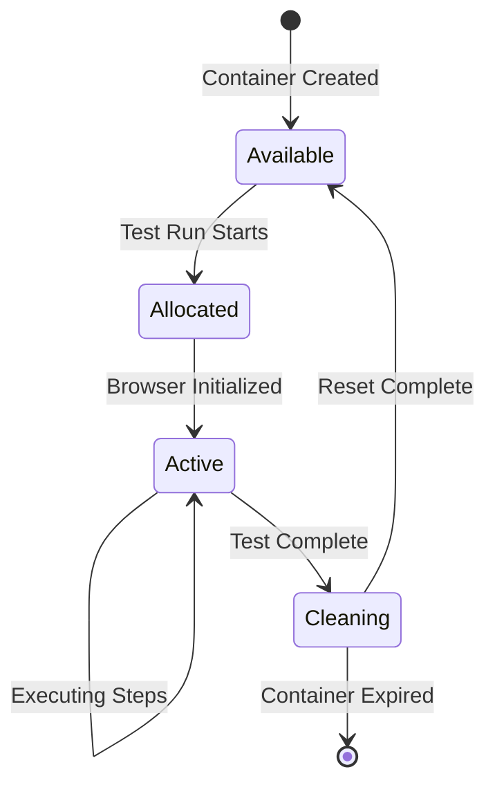

# Adaptive Test Execution Strategy for Cinnamon-QA

## Executive Summary

This document outlines the adaptive test execution strategy for Cinnamon-QA, addressing the challenges of dynamic web environments and ensuring reliable E2E test execution through AI-driven feedback loops and proper container isolation.

## Problem Statement

### Current Limitations
1. **Container Contamination**: Multiple test scenarios sharing the same MCP container can lead to session pollution
2. **Static Execution**: Tests assume a "happy path" without adapting to actual page states
3. **No Feedback Loop**: Worker executes predefined steps without validation or correction
4. **Dynamic Web Challenges**: Modern web apps have varying states, loading times, and UI variations

### Requirements
- Each test run must have a dedicated, isolated container
- Test execution must adapt to actual page states
- AI must provide real-time guidance based on current context
- Failed steps should trigger recovery mechanisms

## Architecture Overview

```
┌─────────────┐     ┌─────────────┐     ┌─────────────┐
│   Worker    │────▶│  AI Agent   │────▶│ MCP Pool    │
│  (Adaptive) │◀────│  (Gemini)   │◀────│ (Isolated)  │
└─────────────┘     └─────────────┘     └─────────────┘
       │                                         │
       ▼                                         ▼
┌─────────────┐                         ┌─────────────┐
│   Redis     │                         │  Container  │
│   Queue     │                         │  per Test   │
└─────────────┘                         └─────────────┘
```

## Core Components

### 1. MCP Container Pool Management

#### Container Isolation Strategy
```typescript
interface ContainerPoolConfig {
  maxContainers: number;
  containerTimeout: number;
  isolationMode: 'strict'; // One container per test run
}

class MCPContainerPool {
  private availableContainers: Queue<MCPContainer>;
  private activeContainers: Map<string, MCPContainer>;
  
  async allocateForTestRun(testRunId: string): Promise<MCPContainer> {
    // Ensure exclusive container allocation
    const container = await this.getOrCreateContainer();
    container.setExclusive(testRunId);
    this.activeContainers.set(testRunId, container);
    
    // Initialize clean browser context
    await container.initializeBrowserContext({
      viewport: { width: 1920, height: 1080 },
      userAgent: 'Cinnamon-QA/1.0',
      locale: 'en-US'
    });
    
    return container;
  }
  
  async releaseContainer(testRunId: string): Promise<void> {
    const container = this.activeContainers.get(testRunId);
    if (container) {
      await container.cleanup(); // Close browser, clear cookies
      await container.reset();   // Reset to clean state
      this.availableContainers.push(container);
      this.activeContainers.delete(testRunId);
    }
  }
}
```

#### Container Lifecycle


### 2. Adaptive Test Execution Engine

#### Execution Flow
```typescript
class AdaptiveTestExecutor {
  private container: MCPContainer;
  private ai: AIAgent;
  private context: TestExecutionContext;
  
  async execute(testCase: TestCase): Promise<TestResult> {
    this.context = new TestExecutionContext(testCase);
    
    try {
      // Initial page load and validation
      await this.initializeTestEnvironment(testCase.url);
      
      // Execute steps with adaptation
      for (const [index, step] of testCase.steps.entries()) {
        await this.executeAdaptiveStep(step, index);
      }
      
      return this.context.generateResult();
      
    } catch (error) {
      return this.handleTestFailure(error);
    }
  }
  
  private async executeAdaptiveStep(step: TestStep, index: number) {
    // 1. Capture current state
    const pageState = await this.capturePageState();
    
    // 2. Validate step feasibility
    const validation = await this.validateStep(step, pageState);
    
    // 3. Adapt if necessary
    if (!validation.isValid) {
      const adaptedSteps = await this.adaptTestPlan(
        step, 
        pageState, 
        validation.issues
      );
      this.context.recordAdaptation(step, adaptedSteps, validation.reason);
      step = adaptedSteps[0]; // Use adapted step
    }
    
    // 4. Execute with retry logic
    const result = await this.executeWithRetry(step, {
      maxAttempts: 3,
      backoff: 'exponential'
    });
    
    // 5. Handle failure with recovery
    if (!result.success) {
      await this.attemptRecovery(step, result.error, pageState);
    }
    
    this.context.recordStepResult(result);
  }
}
```

#### Page State Capture
```typescript
interface PageState {
  url: string;
  title: string;
  readyState: 'loading' | 'interactive' | 'complete';
  
  // Visual state
  screenshot: Buffer;
  viewport: { width: number; height: number };
  
  // DOM state
  dom: {
    html: string;
    visibleElements: ElementInfo[];
    interactableElements: ElementInfo[];
    forms: FormInfo[];
  };
  
  // Network state
  pendingRequests: number;
  failedRequests: NetworkError[];
  
  // Console state
  errors: ConsoleError[];
  warnings: string[];
  
  // Metadata
  capturedAt: Date;
  captureTime: number; // milliseconds
}

interface ElementInfo {
  selector: string;
  tagName: string;
  text: string;
  attributes: Record<string, string>;
  isVisible: boolean;
  isEnabled: boolean;
  boundingBox: BoundingBox;
}
```

### 3. AI-Driven Adaptation

#### AI Integration Points
```typescript
class AITestAdapter {
  private gemini: GeminiClient;
  
  async validateStep(
    step: TestStep, 
    pageState: PageState
  ): Promise<ValidationResult> {
    const prompt = this.buildValidationPrompt(step, pageState);
    const response = await this.gemini.generateContent(prompt);
    
    return {
      isValid: response.canExecute,
      confidence: response.confidence,
      issues: response.identifiedIssues,
      suggestions: response.alternatives
    };
  }
  
  async adaptTestPlan(
    failedStep: TestStep,
    currentState: PageState,
    previousSteps: StepResult[]
  ): Promise<TestStep[]> {
    const context = {
      objective: this.extractObjective(failedStep),
      currentPage: this.summarizePageState(currentState),
      completedActions: previousSteps.map(s => s.action),
      availableElements: currentState.dom.interactableElements
    };
    
    const adaptedPlan = await this.gemini.generateAdaptedPlan(context);
    return this.parseAdaptedSteps(adaptedPlan);
  }
  
  async suggestRecovery(
    error: TestError,
    pageState: PageState
  ): Promise<RecoveryStrategy> {
    // Analyze error type and suggest recovery
    const errorAnalysis = await this.analyzeError(error, pageState);
    
    switch (errorAnalysis.type) {
      case 'ElementNotFound':
        return this.suggestAlternativeSelectors(error.selector, pageState);
      
      case 'PageNotLoaded':
        return { action: 'wait', duration: 5000, retry: true };
      
      case 'UnexpectedPage':
        return this.suggestNavigation(pageState, error.expectedUrl);
      
      case 'AuthRequired':
        return this.suggestAuthentication(pageState);
      
      default:
        return { action: 'skip', reason: 'Unrecoverable error' };
    }
  }
}
```

#### Prompt Templates
```typescript
const AI_PROMPTS = {
  validateStep: `
    You are a QA automation expert. Analyze if the following action can be performed on the current page.
    
    Planned Action:
    - Type: {action.type}
    - Target: {action.selector}
    - Value: {action.value}
    
    Current Page State:
    - URL: {page.url}
    - Title: {page.title}
    - Available Elements: {page.elements}
    
    Respond with:
    1. Can this action be executed? (yes/no)
    2. Confidence level (0-100)
    3. If no, what are the issues?
    4. Suggest alternative approaches
  `,
  
  adaptTestPlan: `
    The test execution has encountered an issue. Help adapt the test plan.
    
    Original Objective: {objective}
    Failed Step: {failedStep}
    Current Page: {pageDescription}
    
    Available Interactive Elements:
    {elements}
    
    Provide an alternative sequence of steps to achieve the same objective.
    Consider:
    - Different UI paths
    - Alternative selectors
    - Additional wait conditions
    - Intermediate steps that might be needed
  `,
  
  analyzeError: `
    Analyze this test execution error and categorize it.
    
    Error: {error.message}
    Stack: {error.stack}
    Failed Action: {action}
    Page State: {pageState}
    
    Categorize as one of:
    - ElementNotFound
    - PageNotLoaded  
    - UnexpectedPage
    - NetworkError
    - AuthRequired
    - UnknownError
    
    Provide recovery suggestions.
  `
};
```

### 4. Feedback Loop Implementation

#### Continuous Learning
```typescript
interface FeedbackLoop {
  // Collect execution patterns
  recordSuccess(step: TestStep, pageState: PageState): void;
  recordFailure(step: TestStep, error: Error, pageState: PageState): void;
  recordAdaptation(original: TestStep, adapted: TestStep, reason: string): void;
  
  // Learn from patterns
  getSelectorReliability(selector: string): number;
  getCommonFailurePatterns(url: string): FailurePattern[];
  getSuccessfulAdaptations(scenario: string): Adaptation[];
}

class TestExecutionFeedback implements FeedbackLoop {
  async recordSuccess(step: TestStep, pageState: PageState) {
    await this.db.feedback.create({
      type: 'success',
      step: step,
      pageContext: this.extractContext(pageState),
      timestamp: new Date()
    });
    
    // Update selector reliability score
    await this.updateSelectorScore(step.selector, 1.0);
  }
  
  async recordFailure(step: TestStep, error: Error, pageState: PageState) {
    const analysis = await this.ai.analyzeFailure(error, pageState);
    
    await this.db.feedback.create({
      type: 'failure',
      step: step,
      error: error.message,
      analysis: analysis,
      pageContext: this.extractContext(pageState),
      timestamp: new Date()
    });
    
    // Decrease selector reliability
    await this.updateSelectorScore(step.selector, -0.5);
  }
}
```

## Implementation Phases

### Phase 1: Container Isolation (Week 1-2)
- [ ] Implement MCPContainerPool class
- [ ] Create container allocation/release logic  
- [ ] Add container health monitoring
- [ ] Test isolation between concurrent tests

### Phase 2: Basic Adaptation (Week 3-4)
- [ ] Implement page state capture
- [ ] Create step validation logic
- [ ] Add basic retry mechanisms
- [ ] Implement error categorization

### Phase 3: AI Integration (Week 5-6)
- [ ] Integrate Gemini for step validation
- [ ] Implement test plan adaptation
- [ ] Add recovery suggestions
- [ ] Create prompt templates

### Phase 4: Feedback Loop (Week 7-8)
- [ ] Build feedback collection system
- [ ] Implement pattern recognition
- [ ] Add learning mechanisms
- [ ] Create adaptation history

## Monitoring and Metrics

### Key Performance Indicators
```typescript
interface TestExecutionMetrics {
  // Reliability
  successRate: number;
  adaptationRate: number;
  recoverySuccessRate: number;
  
  // Performance  
  avgExecutionTime: number;
  avgStepDuration: number;
  containerUtilization: number;
  
  // Quality
  falsePositiveRate: number;
  falseNegativeRate: number;
  humanInterventionRate: number;
}
```

### Monitoring Dashboard
```sql
-- Adaptation effectiveness
SELECT 
  COUNT(*) as total_adaptations,
  SUM(CASE WHEN successful THEN 1 ELSE 0 END) as successful_adaptations,
  AVG(confidence_score) as avg_ai_confidence
FROM test_adaptations
WHERE created_at > NOW() - INTERVAL '7 days';

-- Container utilization
SELECT 
  COUNT(DISTINCT container_id) as active_containers,
  AVG(test_duration) as avg_test_duration,
  MAX(concurrent_tests) as peak_concurrency
FROM container_metrics
WHERE timestamp > NOW() - INTERVAL '1 hour';
```

## Best Practices

### 1. Container Management
- Always allocate containers exclusively per test run
- Implement proper cleanup and reset procedures
- Monitor container health and restart if needed
- Use container pools to minimize startup time

### 2. AI Integration
- Keep prompts focused and specific
- Include relevant context without overwhelming
- Implement fallbacks for AI failures
- Cache AI responses for similar scenarios

### 3. Error Handling
- Categorize errors for appropriate recovery
- Implement exponential backoff for retries
- Log all adaptations for analysis
- Fail fast on unrecoverable errors

### 4. Performance Optimization
- Capture only necessary page state
- Implement smart waiting strategies
- Batch AI requests when possible
- Use parallel execution where safe

## Security Considerations

### Container Security
- Run containers with minimal privileges
- Implement network isolation
- Regular security updates
- Monitor for suspicious activities

### Data Protection
- Sanitize sensitive data in logs
- Encrypt screenshots at rest
- Implement access controls
- Regular security audits

## Future Enhancements

### Advanced AI Features
- Multi-model consensus for critical decisions
- Predictive test planning
- Automatic test generation from user behavior
- Visual regression detection

### Scalability Improvements
- Kubernetes-based container orchestration
- Distributed test execution
- Global test infrastructure
- Edge-based testing

## Conclusion

This adaptive test execution strategy transforms Cinnamon-QA from a simple script runner into an intelligent testing system that can handle the complexities of modern web applications. By combining container isolation, AI-driven adaptation, and continuous feedback loops, we ensure reliable and maintainable E2E testing.

The phased implementation approach allows for gradual adoption while maintaining system stability. Each phase builds upon the previous, ultimately creating a robust testing platform that can adapt to any web application's unique challenges.