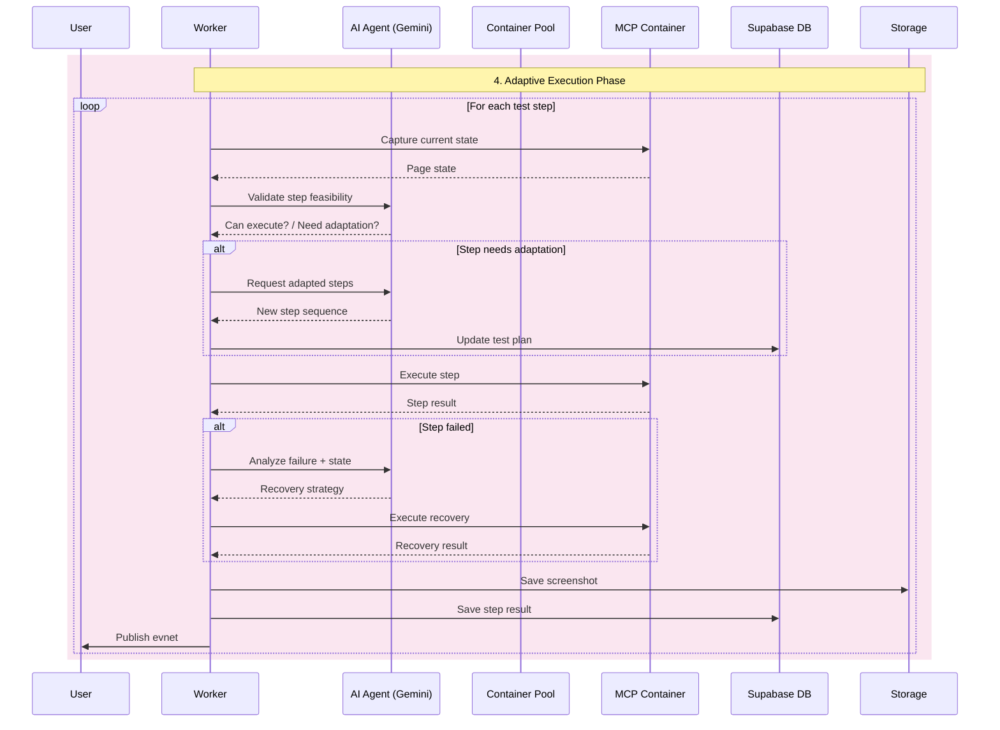

```mermaid
sequenceDiagram
    participant U as User
    participant W as Worker
    participant AI as AI Agent (Gemini)
    participant CP as Container Pool
    participant MCP as MCP Container
    participant DB as Supabase DB
    participant S as Storage

    rect rgb(250, 230, 240)
        Note over W,S: 4. Adaptive Execution Phase
        loop For each test step
            W->>MCP: Capture current state
            MCP-->>W: Page state
            
            W->>AI: Validate step feasibility
            AI-->>W: Can execute? / Need adaptation?
            
            alt Step needs adaptation
                W->>AI: Request adapted steps
                AI-->>W: New step sequence
                W->>DB: Update test plan
            end
            
            W->>MCP: Execute step
            MCP-->>W: Step result
            
            alt Step failed
                W->>AI: Analyze failure + state
                AI-->>W: Recovery strategy
                W->>MCP: Execute recovery
                MCP-->>W: Recovery result
            end
            
            W->>S: Save screenshot
            W->>DB: Save step result
            W->>U: Publish evnet
        end
    end
```