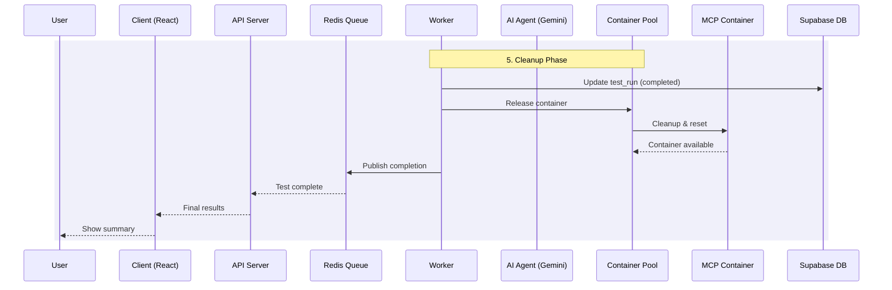

```mermaid
sequenceDiagram
    participant U as User
    participant C as Client (React)
    participant A as API Server
    participant R as Redis Queue
    participant W as Worker
    participant AI as AI Agent (Gemini)
    participant CP as Container Pool
    participant MCP as MCP Container
    participant DB as Supabase DB

    rect rgb(240, 240, 250)
        Note over W,CP: 5. Cleanup Phase
        W->>DB: Update test_run (completed)
        W->>CP: Release container
        CP->>MCP: Cleanup & reset
        MCP-->>CP: Container available
        W->>R: Publish completion
        R-->>A: Test complete
        A-->>C: Final results
        C-->>U: Show summary
    end
```