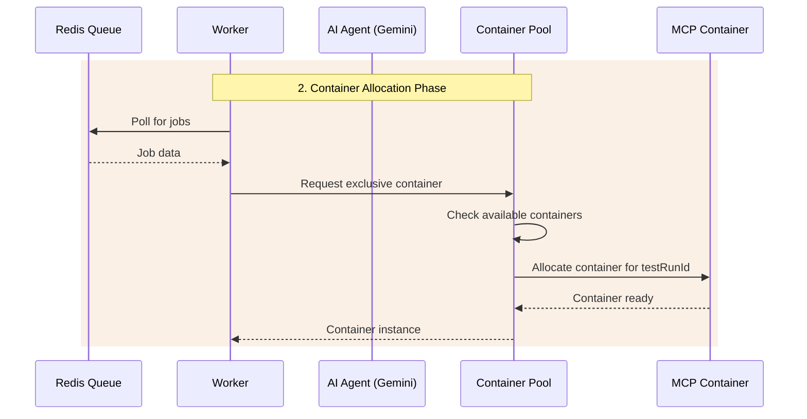

```mermaid
sequenceDiagram
    participant R as Redis Queue
    participant W as Worker
    participant AI as AI Agent (Gemini)
    participant CP as Container Pool
    participant MCP as MCP Container

    rect rgb(250, 240, 230)
        Note over W,CP: 2. Container Allocation Phase
        W->>R: Poll for jobs
        R-->>W: Job data
        W->>CP: Request exclusive container
        CP->>CP: Check available containers
        CP->>MCP: Allocate container for testRunId
        MCP-->>CP: Container ready
        CP-->>W: Container instance
    end
```