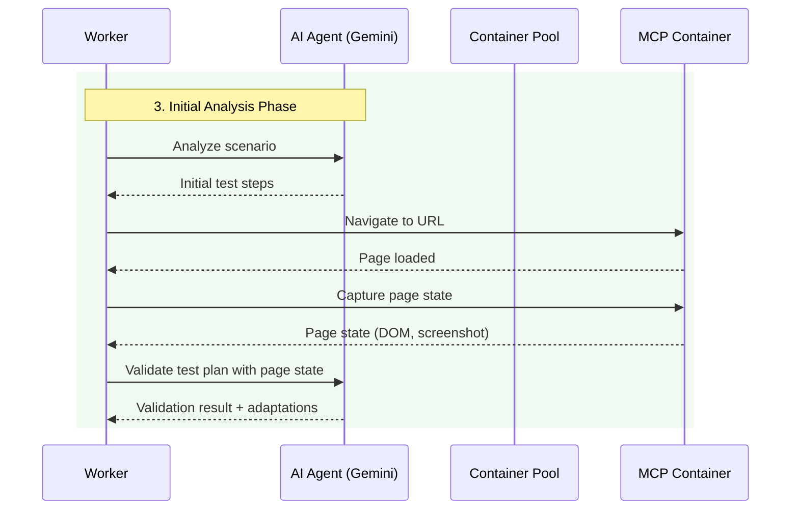

```mermaid
sequenceDiagram
    participant W as Worker
    participant AI as AI Agent (Gemini)
    participant CP as Container Pool
    participant MCP as MCP Container

    rect rgb(240, 250, 240)
        Note over W,AI: 3. Initial Analysis Phase
        W->>AI: Analyze scenario
        AI-->>W: Initial test steps
        W->>MCP: Navigate to URL
        MCP-->>W: Page loaded
        W->>MCP: Capture page state
        MCP-->>W: Page state (DOM, screenshot)
        W->>AI: Validate test plan with page state
        AI-->>W: Validation result + adaptations
    end
```