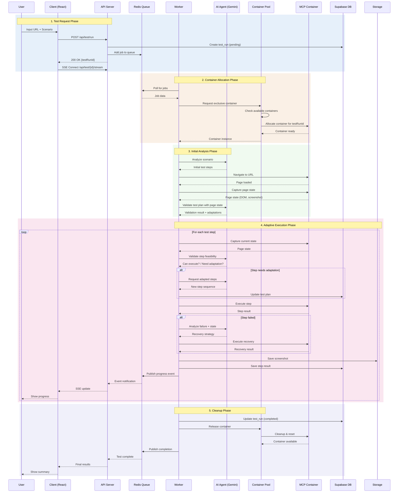

```mermaid
sequenceDiagram
    participant U as User
    participant C as Client (React)
    participant A as API Server
    participant R as Redis Queue
    participant W as Worker
    participant AI as AI Agent (Gemini)
    participant CP as Container Pool
    participant MCP as MCP Container
    participant DB as Supabase DB
    participant S as Storage

    rect rgb(230, 240, 250)
        Note over U,A: 1. Test Request Phase
        U->>C: Input URL + Scenario
        C->>A: POST /api/test/run
        A->>DB: Create test_run (pending)
        A->>R: Add job to queue
        A-->>C: 200 OK {testRunId}
        C->>A: SSE Connect /api/test/{id}/stream
    end

    rect rgb(250, 240, 230)
        Note over W,CP: 2. Container Allocation Phase
        W->>R: Poll for jobs
        R-->>W: Job data
        W->>CP: Request exclusive container
        CP->>CP: Check available containers
        CP->>MCP: Allocate container for testRunId
        MCP-->>CP: Container ready
        CP-->>W: Container instance
    end

    rect rgb(240, 250, 240)
        Note over W,AI: 3. Initial Analysis Phase
        W->>AI: Analyze scenario
        AI-->>W: Initial test steps
        W->>MCP: Navigate to URL
        MCP-->>W: Page loaded
        W->>MCP: Capture page state
        MCP-->>W: Page state (DOM, screenshot)
        W->>AI: Validate test plan with page state
        AI-->>W: Validation result + adaptations
    end

    rect rgb(250, 230, 240)
        Note over W,S: 4. Adaptive Execution Phase
        loop For each test step
            W->>MCP: Capture current state
            MCP-->>W: Page state
            
            W->>AI: Validate step feasibility
            AI-->>W: Can execute? / Need adaptation?
            
            alt Step needs adaptation
                W->>AI: Request adapted steps
                AI-->>W: New step sequence
                W->>DB: Update test plan
            end
            
            W->>MCP: Execute step
            MCP-->>W: Step result
            
            alt Step failed
                W->>AI: Analyze failure + state
                AI-->>W: Recovery strategy
                W->>MCP: Execute recovery
                MCP-->>W: Recovery result
            end
            
            W->>S: Save screenshot
            W->>DB: Save step result
            W->>R: Publish progress event
            R-->>A: Event notification
            A-->>C: SSE update
            C-->>U: Show progress
        end
    end

    rect rgb(240, 240, 250)
        Note over W,CP: 5. Cleanup Phase
        W->>DB: Update test_run (completed)
        W->>CP: Release container
        CP->>MCP: Cleanup & reset
        MCP-->>CP: Container available
        W->>R: Publish completion
        R-->>A: Test complete
        A-->>C: Final results
        C-->>U: Show summary
    end
```