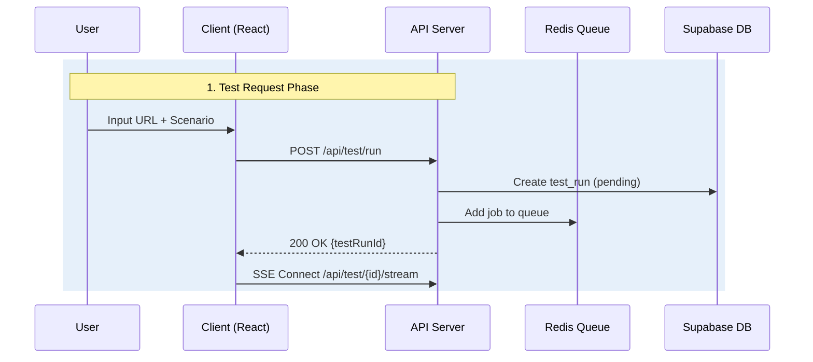

```mermaid
sequenceDiagram
    participant U as User
    participant C as Client (React)
    participant A as API Server
    participant R as Redis Queue
    participant DB as Supabase DB

    rect rgb(230, 240, 250)
        Note over U,A: 1. Test Request Phase
        U->>C: Input URL + Scenario
        C->>A: POST /api/test/run
        A->>DB: Create test_run (pending)
        A->>R: Add job to queue
        A-->>C: 200 OK {testRunId}
        C->>A: SSE Connect /api/test/{id}/stream
    end
```