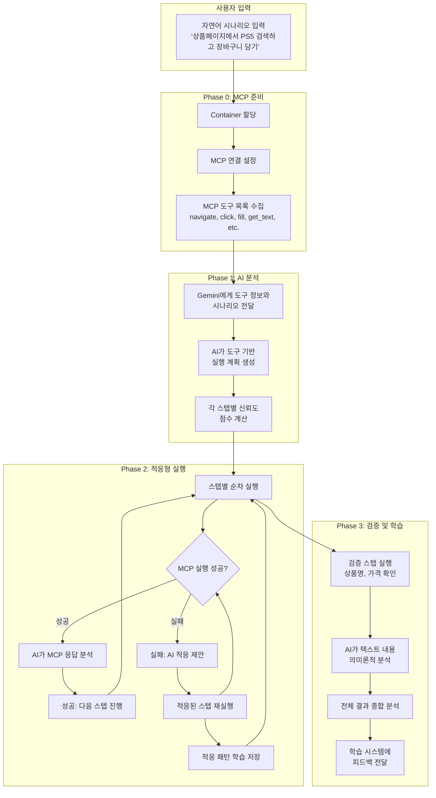
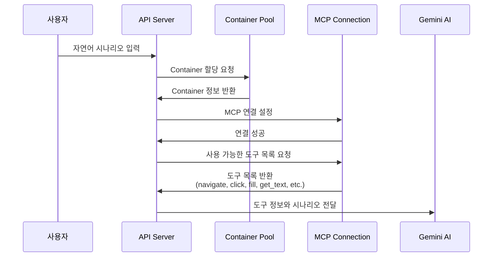
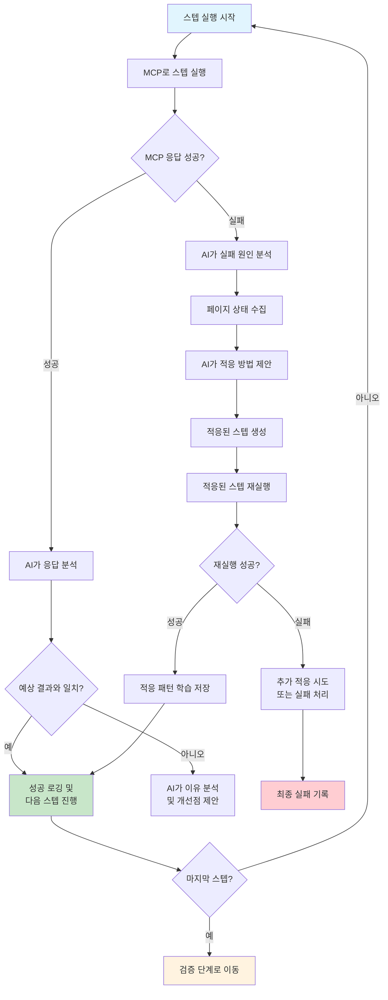
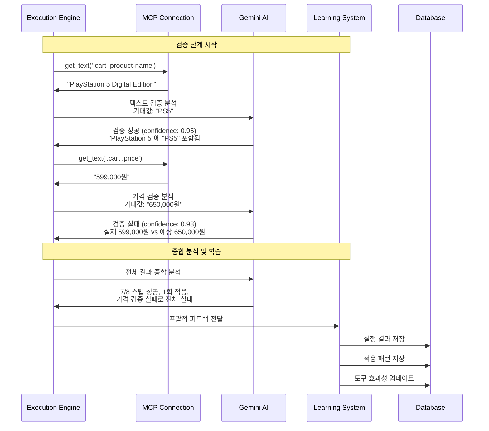
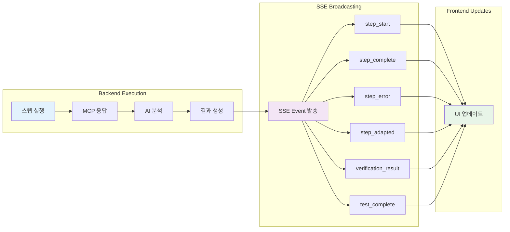
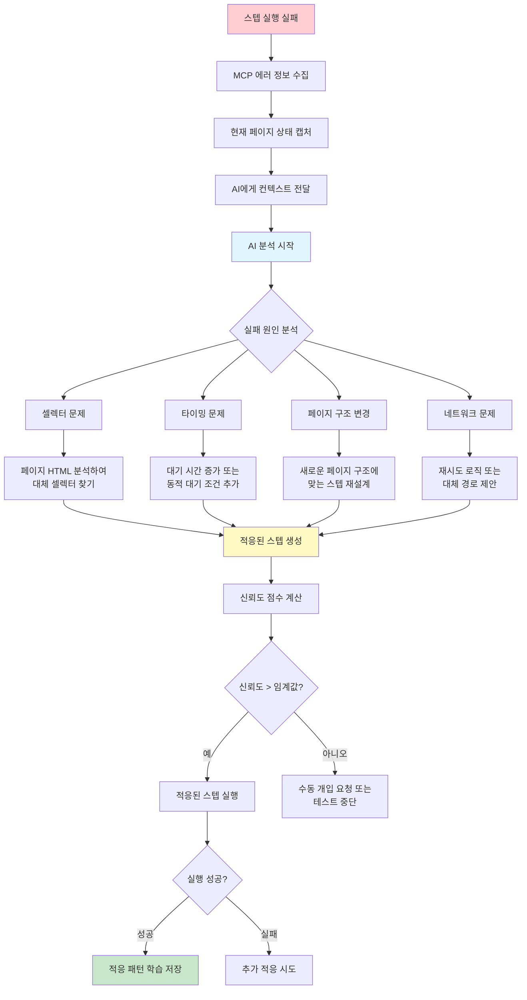
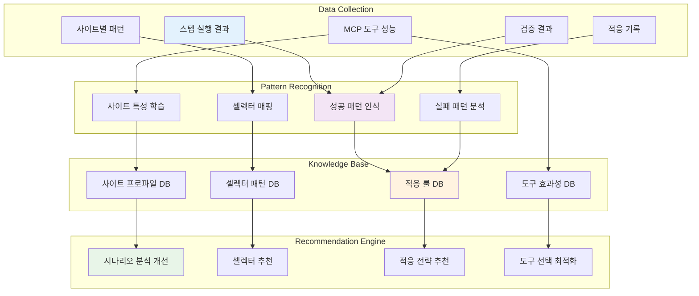
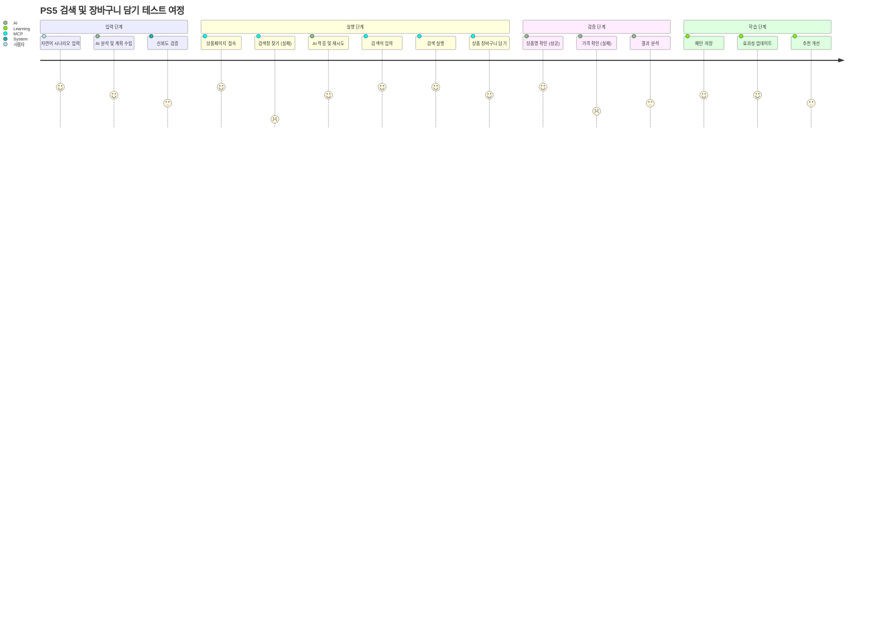

# Task 5: AI Integration Execution Flow Diagrams

## 🎬 전체 시스템 플로우



## 🔄 세부 실행 프로세스

### Phase 0: MCP 도구 준비



### Phase 1: AI 시나리오 분석

```mermaid
flowchart TD
    A[자연어 시나리오<br/>'상품페이지에서 PS5 검색하고 장바구니 담기'] --> B[Gemini AI 분석]
    
    B --> C[구조화된 스텝 생성]
    
    C --> D1[Step 1: navigate<br/>url: 'https://site.com/products'<br/>confidence: 0.95]
    C --> D2[Step 2: wait_for_element<br/>selector: 'input[name=search]'<br/>confidence: 0.90]
    C --> D3[Step 3: fill<br/>selector: 'input[name=search]'<br/>value: 'ps5'<br/>confidence: 0.88]
    C --> D4[Step 4: click<br/>selector: 'button[type=submit]'<br/>confidence: 0.85]
    C --> D5[Step 5: wait_for_element<br/>selector: '.product-list'<br/>confidence: 0.80]
    C --> D6[Step 6: click<br/>selector: '.product:first .add-cart'<br/>confidence: 0.75]
    C --> D7[Step 7: get_text<br/>selector: '.cart .product-name'<br/>confidence: 0.70]
    C --> D8[Step 8: get_text<br/>selector: '.cart .price'<br/>confidence: 0.70]
    
    D1 --> E[신뢰도 검증 및<br/>실행 준비]
    D2 --> E
    D3 --> E
    D4 --> E
    D5 --> E
    D6 --> E
    D7 --> E
    D8 --> E
```

### Phase 2: 적응형 실행 루프



### Phase 3: 검증 및 학습



## 📊 실시간 SSE 업데이트 플로우



## 🧠 AI 적응 과정 상세



## 📈 학습 시스템 데이터 플로우



## 🎯 사용자 시나리오 예시 플로우



이 다이어그램들은 Task 5의 전체 실행 흐름을 시각적으로 보여주며, 각 단계에서의 AI-MCP 상호작용과 학습 과정을 명확히 나타냅니다.