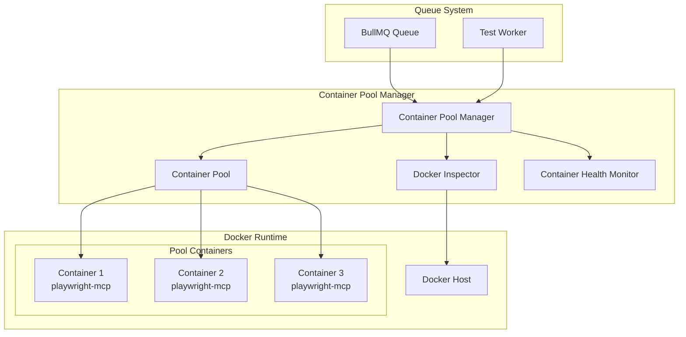

# Container Pool Management Strategy

## 📋 전체 관리 계획

### 1. 아키텍처 개요



### 2. Playwright-MCP 관리 전략

#### 2.1 Microsoft Playwright-MCP 활용
- **기존 이미지 활용**: `mcr.microsoft.com/playwright/mcp` Docker 이미지 사용
- **헤드리스 Chrome**: 현재 지원하는 헤드리스 Chromium 활용
- **MCP 프로토콜**: 구조화된 데이터 기반 자동화 (픽셀 기반 아님)
- **접근성 트리**: 스냅샷 모드를 기본으로 사용

#### 2.2 컨테이너 구성
**Microsoft 공식 이미지 직접 사용**: `mcr.microsoft.com/playwright/mcp:latest`

```yaml
# docker-compose에서 직접 사용 예시
services:
  playwright-mcp-pool:
    image: mcr.microsoft.com/playwright/mcp:latest
    environment:
      - CONTAINER_POOL_ID=${CONTAINER_ID}
      - PLAYWRIGHT_HEADLESS=true
    networks:
      - cinnamon-qa-network
    healthcheck:
      test: ["CMD-SHELL", "timeout 5s bash -c '</dev/tcp/localhost/3000' || exit 1"]
      interval: 30s
      timeout: 10s
      retries: 3
      start_period: 10s
    mem_limit: 512m
    cpus: 0.5
```

**장점:**
- 별도 Dockerfile 불필요
- Microsoft 공식 이미지의 안정성 보장
- 업데이트 시 이미지만 교체하면 됨
- 불필요한 래핑 레이어 제거

### 3. Container Pool 관리 시스템

#### 3.1 Pool 구조 (수정된 전략)
```typescript
interface ContainerPool {
  // 풀 관리 (간소화)
  minSize: number;          // 최소 컨테이너 수 (2개)
  maxSize: number;          // 최대 컨테이너 수 (10개)
  initialSize: number;      // 초기 구동 컨테이너 수 (2개)
  
  // 컨테이너 상태
  available: Container[];   // 사용 가능한 컨테이너
  allocated: Container[];   // 할당된 컨테이너
  restarting: Container[];  // 재시작 중인 컨테이너
}

interface ContainerState {
  id: string;
  status: 'available' | 'allocated' | 'restarting' | 'unhealthy';
  testRunId?: string;
  allocatedAt?: Date;
  lastCleanupAt?: Date;
  errorCount: number;       // 연속 에러 횟수
  memoryUsageMB: number;    // 현재 메모리 사용량
}
```

#### 3.2 컨테이너 재시작 기준 (간소화)
```typescript
const RESTART_CONDITIONS = {
  maxMemoryMB: 400,         // 400MB 초과시 재시작
  errorThreshold: 3,        // 연속 3회 에러시 재시작
};

// 재시작 로직
async shouldRestart(container: ContainerState): Promise<boolean> {
  return container.memoryUsageMB > RESTART_CONDITIONS.maxMemoryMB ||
         container.errorCount >= RESTART_CONDITIONS.errorThreshold;
}
```

#### 3.3 컨테이너 생명주기 (단순화)
1. **시작 (Starting)**: Docker 컨테이너 생성 및 playwright-mcp 초기화
2. **사용 가능 (Available)**: 풀에서 할당 대기
3. **할당됨 (Allocated)**: 테스트 작업에 독점 할당
4. **정리 (Cleaning)**: 테스트 완료 후 브라우저 상태 빠른 정리
5. **재시작 (Restarting)**: 메모리/에러 기준 초과시 컨테이너 재시작

### 4. Docker 환경 관리

#### 4.1 Docker 설치 확인 및 초기화
```typescript
class DockerInspector {
  // Docker 설치 확인
  async checkDockerInstallation(): Promise<boolean>
  
  // Docker 서비스 상태 확인
  async checkDockerService(): Promise<boolean>
  
  // playwright-mcp 이미지 확인 및 다운로드
  async ensurePlaywrightMCPImage(): Promise<boolean>
  
  // Docker 네트워크 설정
  async setupDockerNetwork(): Promise<string>
}
```

#### 4.2 컨테이너 상태 관리 (단순화)
```typescript
// 메모리 기반 간단한 상태 관리
interface PoolState {
  totalContainers: number;
  availableContainers: Container[];
  allocatedContainers: Map<string, Container>; // testRunId -> Container
  restartingContainers: Container[];
}

class SimplePoolManager {
  private state: PoolState = {
    totalContainers: 0,
    availableContainers: [],
    allocatedContainers: new Map(),
    restartingContainers: []
  };

  // 간단한 메트릭 조회
  getPoolMetrics() {
    return {
      total: this.state.totalContainers,
      available: this.state.availableContainers.length,
      allocated: this.state.allocatedContainers.size,
      restarting: this.state.restartingContainers.length
    };
  }
}
```

#### 4.3 컨테이너 네트워킹
- **전용 네트워크**: `cinnamon-qa-network` 네트워크 사용
- **포트 매핑**: 동적 포트 할당 (3000번대)
- **내부 통신**: Redis와 API 서버 접근을 위한 네트워크 구성

### 5. Container Pool Manager 구현

#### 5.1 핵심 기능
```typescript
class ContainerPoolManager {
  // 풀 관리
  async initializePool(): Promise<void>
  async expandPool(count: number): Promise<void>
  async shrinkPool(count: number): Promise<void>
  
  // 컨테이너 할당/해제
  async allocateContainer(testRunId: string): Promise<Container>
  async releaseContainer(containerId: string): Promise<void>
  
  // 헬스 모니터링
  async healthCheck(): Promise<PoolHealth>
  async replaceUnhealthyContainers(): Promise<void>
  
  // 자동 정리
  async cleanupExpiredContainers(): Promise<void>
  async resetContainerState(containerId: string): Promise<void>
}
```

#### 5.2 리소스 관리
- **메모리 제한**: 컨테이너당 512MB 메모리 제한
- **CPU 제한**: 컨테이너당 0.5 CPU 코어 제한
- **타임아웃 관리**: 30분 이상 사용된 컨테이너 자동 회수
- **동시성 제어**: 최대 동시 실행 테스트 수 제한

### 6. 헬스 모니터링 시스템

#### 6.1 모니터링 지표
- **컨테이너 상태**: Running, Healthy, Memory/CPU 사용량
- **응답 시간**: Playwright-MCP 응답 속도
- **에러율**: 컨테이너별 실패율 추적
- **풀 통계**: 사용률, 대기 시간, 처리량

#### 6.2 자동 복구 메커니즘
- **헬스체크 실패**: 3회 연속 실패시 컨테이너 교체
- **메모리 리크**: 메모리 사용량 임계치 초과시 재시작
- **응답 지연**: 5초 이상 응답 없으면 컨테이너 재시작
- **풀 부족**: 사용 가능한 컨테이너 부족시 자동 확장

### 7. 테스트 실행 플로우

#### 7.1 테스트 시작
1. **컨테이너 요청**: BullMQ Job에서 컨테이너 할당 요청
2. **풀에서 할당**: 사용 가능한 컨테이너를 독점 할당
3. **상태 초기화**: 브라우저 캐시/세션 정리
4. **테스트 실행**: Playwright-MCP를 통한 E2E 테스트

#### 7.2 테스트 완료
1. **결과 수집**: 스크린샷, 로그, 성능 데이터 수집
2. **상태 정리**: 브라우저 탭 정리, 세션 초기화
3. **컨테이너 반환**: 풀로 컨테이너 반환
4. **헬스체크**: 컨테이너 상태 확인 후 재사용 준비

### 8. 컨테이너 사용 로깅 시스템

#### 8.1 로그 파일 구조
```
logs/
├── containers/
│   ├── container-pool-2025-01-08.log      # 풀 관리 로그
│   ├── container-usage-2025-01-08.log     # 컨테이너 사용 기록
│   └── container-errors-2025-01-08.log    # 에러 전용 로그
└── archive/
    ├── 2025-01/                           # 월별 아카이브
    └── ...
```

#### 8.2 로그 포맷 (사람이 읽기 쉬운 형태)
```typescript
interface ContainerLogEntry {
  timestamp: string;
  level: 'INFO' | 'WARN' | 'ERROR';
  containerId: string;
  testRunId?: string;
  action: string;
  details: Record<string, any>;
  duration?: number;
}

// 로그 예시
class ContainerLogger {
  // 컨테이너 할당 로그
  logAllocation(containerId: string, testRunId: string) {
    this.log('INFO', containerId, 'ALLOCATED', {
      testRunId,
      memoryUsageMB: await this.getMemoryUsage(containerId),
      availableContainers: await this.getAvailableCount()
    });
  }

  // 컨테이너 정리 로그
  logCleanup(containerId: string, duration: number) {
    this.log('INFO', containerId, 'CLEANUP_COMPLETED', {
      cleanupDurationMs: duration,
      memoryAfterCleanup: await this.getMemoryUsage(containerId)
    });
  }

  // 에러 로그
  logError(containerId: string, error: Error, context: string) {
    this.log('ERROR', containerId, 'ERROR_OCCURRED', {
      errorMessage: error.message,
      errorStack: error.stack,
      context,
      consecutiveErrors: await this.getErrorCount(containerId)
    });
  }

  // 재시작 로그
  logRestart(containerId: string, reason: string) {
    this.log('WARN', containerId, 'CONTAINER_RESTART', {
      reason,
      memoryUsageMB: await this.getMemoryUsage(containerId),
      errorCount: await this.getErrorCount(containerId),
      uptimeMinutes: await this.getUptimeMinutes(containerId)
    });
  }
}
```

#### 8.3 로그 출력 예시
```
[2025-01-08 14:30:15] INFO  container-001 | ALLOCATED
  └─ Test Run: test-run-123
  └─ Memory Usage: 180MB
  └─ Available Containers: 1

[2025-01-08 14:32:45] INFO  container-001 | CLEANUP_COMPLETED
  └─ Test Run: test-run-123
  └─ Cleanup Duration: 1.2s
  └─ Memory After Cleanup: 165MB

[2025-01-08 14:35:20] ERROR container-002 | ERROR_OCCURRED
  └─ Test Run: test-run-124
  └─ Error: Navigation timeout exceeded
  └─ Context: page_navigation
  └─ Consecutive Errors: 2/3

[2025-01-08 14:36:10] WARN  container-002 | CONTAINER_RESTART
  └─ Reason: error_threshold_exceeded
  └─ Memory Usage: 420MB
  └─ Error Count: 3
  └─ Uptime: 45min
```

#### 8.4 로그 분석 기능
```typescript
class ContainerLogAnalyzer {
  // 컨테이너별 사용 패턴 분석
  async analyzeUsagePatterns(containerId: string): Promise<UsageReport> {
    return {
      totalTests: number,
      averageTestDuration: number,
      memoryTrend: 'stable' | 'increasing' | 'decreasing',
      errorRate: number,
      restartFrequency: number,
      riskLevel: 'low' | 'medium' | 'high'
    };
  }

  // 에러 패턴 분석
  async analyzeErrorPatterns(): Promise<ErrorReport> {
    return {
      commonErrors: ErrorPattern[],
      errorsByAction: Map<string, number>,
      memoryLeakContainers: string[],
      frequentRestartContainers: string[]
    };
  }
}
```

### 9. 패키지 구조 (업데이트)

```
packages/containers/
├── src/
│   ├── index.ts                 # 메인 export
│   ├── docker-inspector.ts      # Docker 설치/상태 확인
│   ├── container-pool.ts        # 컨테이너 풀 관리 (메모리 기반)
│   ├── container.ts            # 개별 컨테이너 관리
│   ├── health-monitor.ts       # 헬스 모니터링
│   ├── container-logger.ts     # 컨테이너 로깅 시스템
│   ├── log-analyzer.ts         # 로그 분석 도구
│   └── types.ts               # 타입 정의
├── docker/
│   └── docker-compose.dev.yml  # 개발용 컨테이너 설정
├── logs/                       # 로그 디렉토리
│   ├── containers/
│   └── archive/
├── examples/
│   ├── basic-usage.ts          # 기본 사용 예제
│   ├── pool-monitoring.ts      # 풀 모니터링 예제
│   ├── log-analysis.ts         # 로그 분석 예제
│   └── stress-test.ts          # 부하 테스트 예제
├── STRATEGY.md                 # 이 파일
├── ARCHITECTURE.md             # 상세 아키텍처 문서
├── package.json
└── tsconfig.json
```

### 10. 구현 순서 (업데이트)

1. **Phase 1**: Docker Inspector 및 기본 설정
   - Docker 설치 확인
   - playwright-mcp 이미지 관리
   - 네트워크 설정
   - 로깅 시스템 기반 구축

2. **Phase 2**: Container Pool 핵심 기능
   - 개별 컨테이너 생성/관리
   - 초기 2개 컨테이너 풀 구현
   - 메모리 기반 간단한 상태 관리
   - 기본 할당/해제 로직

3. **Phase 3**: 모니터링 및 재시작 로직
   - 메모리 사용량 모니터링
   - 에러 카운팅 및 재시작 로직
   - 컨테이너 사용 로깅 구현
   - 상세 로그 분석 기능

4. **Phase 4**: 최적화 및 확장 (향후)
   - 성능 최적화
   - 로그 분석 리포트 기능  
   - 운영 모니터링 도구
   - 스케일링 기능 (필요시 추가)

### 10. 보안 고려사항

- **네트워크 격리**: 컨테이너간 격리 및 외부 접근 제한
- **리소스 제한**: 메모리/CPU 사용량 제한으로 DoS 방지
- **권한 최소화**: 컨테이너 실행 권한 최소화
- **이미지 검증**: Microsoft 공식 이미지만 사용

### 12. 성능 목표 (업데이트)

- **초기 풀 크기**: 2개 컨테이너
- **컨테이너 시작 시간**: 5초 이내
- **테스트 할당 지연**: 1초 이내  
- **빠른 정리 시간**: 2초 이내
- **재시작 조건**: 메모리 400MB 초과 또는 에러 3회
- **로그 기록**: 모든 컨테이너 작업 로깅
- **고정 풀 크기**: 초기 2개 컨테이너로 시작 (스케일링은 향후)

### 13. 주요 개선사항 요약

1. ✅ **간소화된 재시작 기준**: 메모리 + 에러 기준만 사용
2. ✅ **메모리 기반 풀 관리**: 복잡한 Redis 스케일링 제거
3. ✅ **초기 2개 컨테이너**: 리소스 효율적 시작
4. ✅ **상세한 로깅 시스템**: 사람이 읽기 쉬운 포맷
5. ✅ **로그 분석 도구**: 사용 패턴 및 에러 분석 기능
6. ✅ **운영 모니터링**: 컨테이너 동작 예측성 향상

이 전략을 바탕으로 실용적이고 모니터링이 용이한 컨테이너 풀 시스템을 구축하겠습니다.