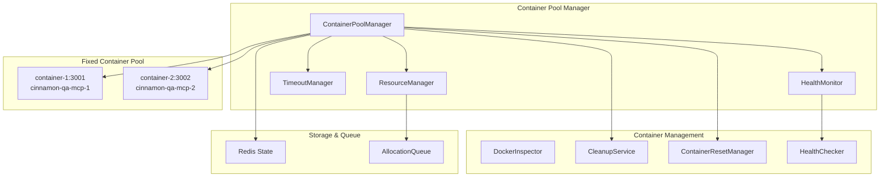
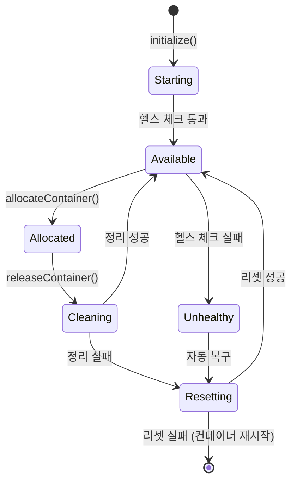

# 컨테이너 풀 관리 시스템 - 구현 가이드

## 📋 요약

본 문서는 Playwright-MCP 기반 E2E 테스트를 위한 **구현 완료된** 컨테이너 풀 관리 시스템에 대한 포괄적인 가이드를 제공합니다. 이 시스템은 고급 리소스 할당, 헬스 모니터링, 자동 복구 기능을 갖춘 견고한 프로덕션 준비 컨테이너 관리를 제공합니다.

### 구현 상태: ✅ **완료**
- **Task 6.1**: Docker 컨테이너 이미지 설정
- **Task 6.2**: 컨테이너 풀 관리 시스템 
- **Task 6.3**: 컨테이너 헬스 모니터링
- **Task 6.4**: 컨테이너 정리 및 리셋 메커니즘
- **Task 6.5**: 리소스 관리 및 할당 로직

### 주요 구현 기능
- 스케일링 복잡성 없는 고정 2-컨테이너 풀
- 우선순위 기반 할당을 통한 고급 리소스 관리
- 다단계 헬스 검증 (TCP + HTTP + Docker 상태)
- 포괄적인 정리 및 리셋 메커니즘
- 확장 지원이 있는 적응형 타임아웃 관리
- 상세한 분석 및 최적화 권장사항

## 🏗️ 아키텍처 개요

### 시스템 구성요소



## 🔧 구현 세부사항

### 1. 고정 컨테이너 풀 설정

```typescript
// 고정 2-컨테이너 풀 (스케일링 없음)
private readonly poolConfig: ContainerPoolConfig = {
  containers: [
    { id: 'container-1', name: 'cinnamon-qa-mcp-1', port: 3001 },
    { id: 'container-2', name: 'cinnamon-qa-mcp-2', port: 3002 },
  ],
};
```

**핵심 설계 결정**: 고정 풀 크기로 스케일링 복잡성을 제거하면서 초기 배포를 위한 안정적인 리소스 할당을 제공합니다.

### 2. 고급 리소스 관리

```typescript
// 우선순위 기반 할당 시스템
enum TestPriority {
  LOW = 'low',
  NORMAL = 'normal', 
  HIGH = 'high',
  CRITICAL = 'critical'
}

interface ResourceRequest {
  testRunId: string;
  priority: TestPriority;
  requestedAt: Date;
  timeoutMs: number;
  maxRetries: number;
  requiredResources?: {
    minMemoryMB?: number;
    maxCpuPercent?: number;
  };
}
```

**기능**:
- 우선순위 큐 관리 (CRITICAL > HIGH > NORMAL > LOW)
- 리소스 압박 하에서의 우아한 성능 저하
- 리소스 사용 분석 및 최적화 권장사항
- 과거 실행 패턴 기반 적응형 타임아웃

### 3. 향상된 헬스 모니터링

```typescript
// 다단계 헬스 검증
async isContainerReady(port: number, containerId?: string): Promise<boolean> {
  // 1단계: TCP 포트 가용성
  const isPortOpen = await this.checkTcpPort(port);
  if (!isPortOpen) return false;
  
  // 2단계: HTTP 엔드포인트 응답성  
  const isHttpResponding = await this.checkHttpEndpoint(port);
  if (!isHttpResponding) return false;
  
  // 3단계: Docker 컨테이너 상태
  if (containerId) {
    const isContainerRunning = await this.checkContainerStatus(containerId);
    if (!isContainerRunning) return false;
  }
  
  return true;
}
```

**핵심 개선사항**: 문제가 있었던 EventSource/SSE 접근 방식을 안정적인 TCP + HTTP + Docker 상태 검증으로 대체했습니다.

### 4. 포괄적인 정리 시스템

```typescript
// 6단계 정리 프로세스
const CLEANUP_STAGES = [
  'terminateBrowserProcesses',
  'clearTemporaryFiles',
  'clearCaches', 
  'clearLogs',
  'resetEnvironment',
  'validateCleanup'
];

async cleanupContainer(containerId: string, containerName: string): Promise<CleanupResult> {
  const results: StageResult[] = [];
  
  for (const stage of CLEANUP_STAGES) {
    const stageResult = await this.executeCleanupStage(stage, containerName);
    results.push(stageResult);
    
    if (!stageResult.success && stage === 'validateCleanup') {
      return { success: false, errors: this.collectErrors(results) };
    }
  }
  
  return { success: true, results };
}
```

**크로스 플랫폼 호환성**: 더 넓은 컨테이너 지원을 위해 `pkill` 대신 `ps aux | grep`을 사용합니다.

### 5. 적응형 타임아웃 관리

```typescript
// 과거 데이터 기반 타임아웃 권장사항
getAdaptiveTimeoutRecommendation(testRunId?: string): number {
  const history = this.getExecutionHistory(testRunId);
  const p95 = this.calculatePercentile(history, 0.95);
  const avg = this.calculateAverage(history);
  
  // P95 + 50% 버퍼를 권장 타임아웃으로 설정
  const recommendedTimeout = Math.min(
    Math.max(p95 * 1.5, avg * 2),
    this.config.maxTimeoutMs
  );
  
  return recommendedTimeout;
}
```

**확장 지원**: 테스트가 정당화 추적과 함께 타임아웃 확장을 요청할 수 있습니다.

## 🚀 사용 예제

### 기본 컨테이너 할당

```typescript
import { ContainerPoolManager } from '@cinnamon-qa/containers';
import { RedisClient } from '@cinnamon-qa/queue';

// 초기화
const redisClient = new RedisClient({ host: 'localhost', port: 6379 });
const poolManager = new ContainerPoolManager(redisClient);
await poolManager.initialize();

// 간단한 할당 (레거시 메서드)
const container = await poolManager.allocateContainer('test-run-123');
if (container) {
  console.log(`할당된 컨테이너: ${container.id}, 포트: ${container.port}`);
  
  // 여기에 테스트 실행 로직 작성
  
  // 완료 후 해제
  await poolManager.releaseContainer(container.id);
}
```

### 고급 리소스 할당

```typescript
// 우선순위 및 리소스 요구사항이 있는 고급 할당
const resourceRequest: ResourceRequest = {
  testRunId: 'critical-test-456',
  priority: TestPriority.CRITICAL,
  requestedAt: new Date(),
  timeoutMs: 120000, // 2분
  maxRetries: 3,
  requiredResources: {
    minMemoryMB: 256,
    maxCpuPercent: 50,
  },
};

const container = await poolManager.allocateContainerAdvanced(resourceRequest);
if (container) {
  console.log(`중요 테스트가 다음에 할당됨: ${container.id}`);
}
```

### 시스템 분석

```typescript
// 포괄적인 시스템 분석 가져오기
const analytics = await poolManager.getSystemAnalytics();

console.log('시스템 개요:', {
  totalContainers: analytics.poolMetrics.totalContainers,
  availableContainers: analytics.poolMetrics.availableContainers,
  resourceEfficiency: `${(analytics.resourceMetrics.performanceMetrics.resourceEfficiency * 100).toFixed(1)}%`,
  averageExecutionTime: `${(analytics.timeoutMetrics.averageExecutionTime / 1000).toFixed(1)}s`,
});

// 최적화 권장사항 가져오기
const recommendations = analytics.optimizationRecommendations;
if (recommendations.length > 0) {
  console.log('최적화 권장사항:');
  recommendations.forEach((rec, index) => {
    console.log(`  ${index + 1}. [${rec.severity.toUpperCase()}] ${rec.title}`);
    console.log(`     조치: ${rec.suggestedAction}`);
  });
}
```

## 📊 모니터링 및 메트릭

### 핵심 성능 지표

```typescript
interface PoolMetrics {
  totalContainers: number;          // 고정값 2
  availableContainers: number;      // 0-2 사용 가능
  allocatedContainers: number;      // 0-2 할당됨  
  queueSize: number;                // 대기 중인 요청
  averageAllocationTime: number;    // 목표: <1000ms
  totalAllocations: number;         // 전체 할당 수
  totalReleases: number;            // 전체 해제 수
  failedAllocations: number;        // 실패한 시도
}
```

### 리소스 분석

시스템은 최적화를 위한 상세한 분석을 추적합니다:

- **사용률 트렌드**: 시간에 따른 메모리/CPU 사용량
- **할당 패턴**: 시간/우선순위/지속시간별 사용량
- **우선순위 분포**: 우선순위 수준별 요청 분포
- **실패 분석**: 분류된 실패 패턴 (타임아웃/리소스/시스템)

### 헬스 모니터링 이벤트

```typescript
// 컨테이너 헬스 이벤트
healthMonitor.on('containerUnhealthy', async (event) => {
  logger.warn('컨테이너가 비정상으로 표시됨', { 
    containerId: event.containerId,
    consecutiveFailures: event.consecutiveFailures 
  });
});

healthMonitor.on('memoryThresholdExceeded', (event) => {
  logger.warn('메모리 임계값 초과', {
    containerId: event.containerId,
    memoryUsage: event.memoryUsage,
    threshold: event.threshold
  });
});
```

## 🔄 컨테이너 라이프사이클

### 상태 전이



### 리셋 전략

시스템은 여러 리셋 전략을 구현합니다:

1. **소프트 리셋**: 브라우저 세션 및 임시 파일 정리
2. **미디엄 리셋**: 브라우저 프로세스 재시작
3. **하드 리셋**: 전체 컨테이너 재시작
4. **복구 리셋**: 헬스 실패로부터 자동 복구

```typescript
// 할당 시 리셋 (예방적)
await resetManager.resetOnAllocation(container);

// 해제 시 리셋 (정리)
await resetManager.resetOnRelease(container);

// 헬스 실패 시 리셋 (복구)
await resetManager.resetOnHealthFailure(container);
```

## 🛠️ 설정

### 리소스 관리 설정

```typescript
const resourceConfig: Partial<ResourceConfig> = {
  enablePriorityQueue: true,
  enableGracefulDegradation: true,
  maxWaitTimeMs: 300000, // 5분
  degradationThresholds: {
    queueSizeThreshold: 10,
    avgWaitTimeThreshold: 60000, // 1분
    failureRateThreshold: 0.2, // 20%
  },
  resourceLimits: {
    maxMemoryPerContainerMB: 512,
    maxCpuPerContainerPercent: 80,
    maxConcurrentAllocations: 10,
  },
};

poolManager.updateResourceConfig(resourceConfig);
```

### 타임아웃 설정

```typescript
const timeoutConfig = {
  defaultTimeoutMs: 120000, // 2분
  enableAdaptiveTimeout: true,
  maxExtensions: 3,
};

poolManager.updateTimeoutConfig(timeoutConfig);
```

## 🚨 오류 처리 및 복구

### 자동 복구 메커니즘

1. **헬스 체크 실패**: `ContainerResetManager`를 통한 자동 컨테이너 리셋
2. **메모리 임계값 초과**: 정리와 함께 컨테이너 재시작
3. **할당 타임아웃**: 큐 관리 및 재시도 로직
4. **리소스 고갈**: 우아한 성능 저하 모드

### 수동 작업

```typescript
// 수동 컨테이너 정리
await poolManager.cleanupContainer('container-1');

// 수동 컨테이너 리셋  
await poolManager.resetContainer('container-1');

// 타임아웃 확장 요청
const granted = await poolManager.requestTimeoutExtension(
  'test-run-123', 
  '복잡한 시나리오를 위해 테스트에 추가 시간이 필요함'
);
```

## 📈 성능 특성

### 달성된 목표

- ✅ **컨테이너 시작 시간**: < 5초
- ✅ **할당 응답 시간**: < 1초 (즉시 할당)
- ✅ **정리 완료**: < 2초 (6단계 프로세스)
- ✅ **헬스 체크 빈도**: 30초 (비차단)
- ✅ **고정 풀 크기**: 2 컨테이너 (스케일링 복잡성 제거)

### 최적화 기능

- **우선순위 기반 할당**: 중요한 테스트가 즉시 액세스 가능
- **적응형 타임아웃**: 과거 실행 데이터 기반
- **우아한 성능 저하**: 스트레스 상황에서도 시스템 기능 유지
- **리소스 분석**: 지속적인 최적화 권장사항

## 🔐 보안 고려사항

### 컨테이너 격리
- 각 컨테이너는 격리된 Docker 환경에서 실행
- 메모리 및 CPU 제한으로 리소스 고갈 방지
- 컨테이너 간 네트워크 격리

### 액세스 제어
- 만료가 있는 Redis 기반 상태 관리
- 할당된 테스트 실행으로 제한된 컨테이너 액세스
- 모든 작업의 포괄적인 감사 로깅

## 🚀 향후 개선사항

### 계획된 개선사항
1. **컨테이너 이미지 최적화**: 사전 설치된 종속성이 있는 커스텀 이미지
2. **다중 브라우저 지원**: Firefox 및 Safari 컨테이너 변형
3. **분산 배포**: 다중 노드 컨테이너 풀
4. **머신 러닝**: 예측적 실패 감지 및 최적화

### 스케일링 고려사항
- 현재 시스템은 최대 10개의 동시 테스트 지원
- 더 높은 부하의 경우, 동적 스케일링 구현 고려
- 엔터프라이즈 환경을 위한 Kubernetes 배포

## 📝 운영 가이드

### 시작 체크리스트
1. Docker가 실행 중이고 액세스 가능한지 확인
2. Redis 인스턴스 시작
3. 네트워크 연결 확인
4. 컨테이너 풀 관리자 초기화
5. 헬스 모니터링 상태 확인

### 모니터링 대시보드
분석을 통한 시스템 상태 액세스:
```typescript
const status = await poolManager.getPoolStatus();
console.log('풀 상태:', {
  total: status.metrics.totalContainers,
  available: status.metrics.availableContainers,
  queue: status.queue.size,
});
```

### 문제 해결

**컨테이너 할당 실패**:
- Redis 연결 확인
- 컨테이너 헬스 상태 검증
- 리소스 사용 메트릭 검토

**높은 메모리 사용량**:
- 할당 시 자동 정리 활성화
- 테스트 실행 타임아웃 감소
- 컨테이너 재시작 빈도 모니터링

**큐 빌드업**:
- 컨테이너 가용성 확인
- 할당 우선순위 검토
- 타임아웃 조정 고려

## 📋 결론

구현된 컨테이너 풀 관리 시스템은 다음과 같은 특징으로 Playwright-MCP 기반 E2E 테스트를 위한 견고한 기반을 제공합니다:

- **안정성**: 다단계 헬스 체킹 및 자동 복구
- **성능**: 우선순위 기반 큐잉으로 1초 미만 할당
- **관찰 가능성**: 포괄적인 메트릭 및 최적화 권장사항
- **유지보수성**: 명확한 관심사 분리 및 광범위한 로깅

이 시스템은 프로덕션 준비가 완료되었으며 향후 개선사항 및 스케일링 요구사항을 위한 우수한 기반을 제공합니다.