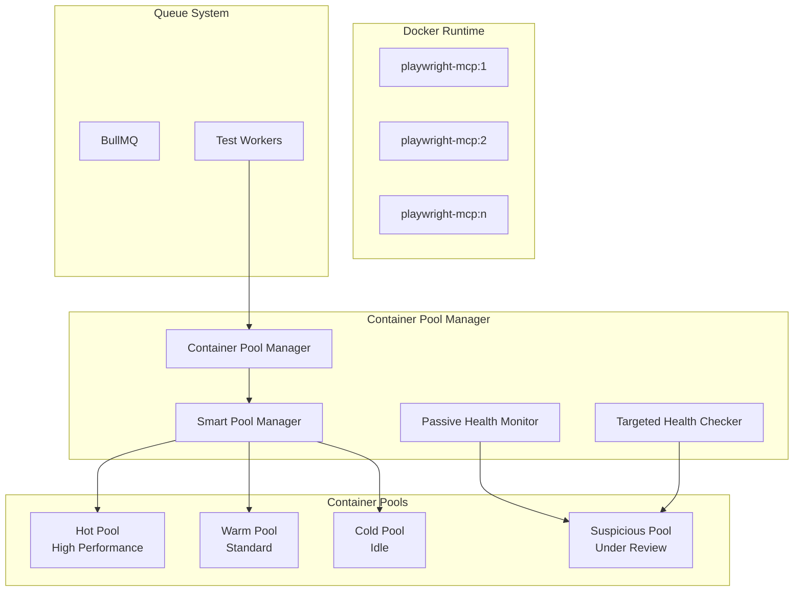

# E2E Test Container Pool Management System - Complete Guide

## 1. Executive Summary

This document provides a comprehensive guide for implementing an E2E testing service using Playwright MCP (Model Context Protocol) Docker containers. The primary goal is to enable **zero-delay test execution** through intelligent container pool management.

### Key Objectives
- Eliminate test startup delays through pre-warmed container pools
- Minimize health check overhead with passive monitoring
- Automatically isolate and recover failed containers
- Scale efficiently based on demand

### Technology Stack
- **Backend**: Node.js with Fastify
- **Queue System**: Redis with BullMQ
- **Container Runtime**: Docker
- **Test Framework**: Playwright MCP (Microsoft official image)
- **Communication**: JSON-RPC over SSE (Server-Sent Events)

## 2. Architecture Overview

### 2.1 System Components



### 2.2 Container State Management

```typescript
// Container states with clear transition rules
enum ContainerState {
  WARMING = 'warming',     // Starting up
  IDLE = 'idle',          // Available in pool
  ALLOCATED = 'allocated', // Assigned to test
  CLEANING = 'cleaning',   // Post-test cleanup
  SUSPICIOUS = 'suspicious', // Potential issues
  RESTARTING = 'restarting' // Being recycled
}

// Smart pool classification
interface PoolClassification {
  hot: Container[];        // Recent success, <1min idle
  warm: Container[];       // Normal performance, <5min idle
  cold: Container[];       // Long idle, >5min
  suspicious: Container[]; // Failed checks or anomalies
}
```

## 3. Health Check Strategy (Core Feature)

### 3.1 Passive Monitoring (Default Approach)

**Principle**: Monitor container behavior without active probing to avoid delays.

```typescript
class PassiveHealthMonitor {
  // Track test lifecycle without blocking
  async markTestStart(containerId: string, testId: string) {
    await this.redis.hset(`container:${containerId}:test`, {
      testId,
      startTime: Date.now(),
      status: 'running'
    });
    
    // Add to active tests sorted set
    await this.redis.zadd('active_tests', Date.now(), `${containerId}:${testId}`);
  }

  async markTestComplete(containerId: string, testId: string) {
    const testInfo = await this.redis.hget(`container:${containerId}:test`);
    const duration = Date.now() - testInfo.startTime;
    
    // Record duration for anomaly detection
    await this.redis.lpush(`container:${containerId}:durations`, duration);
    await this.redis.ltrim(`container:${containerId}:durations`, 0, 99);
    
    // Clean up
    await this.redis.hdel(`container:${containerId}:test`);
    await this.redis.zrem('active_tests', `${containerId}:${testId}`);
  }

  // Background job - runs every 60 seconds
  async detectStuckTests() {
    const threshold = Date.now() - (5 * 60 * 1000); // 5 minutes
    const stuckTests = await this.redis.zrangebyscore('active_tests', 0, threshold);
    
    for (const testKey of stuckTests) {
      const [containerId] = testKey.split(':');
      await this.markContainerSuspicious(containerId, 'test_stuck');
    }
  }
}
```

### 3.2 Targeted Health Checks

Only check containers when necessary, not on every allocation.

```typescript
class TargetedHealthChecker {
  private circuitBreakers = new Map<string, CircuitBreaker>();

  async checkIfNeeded(containerId: string): Promise<boolean> {
    const breaker = this.getCircuitBreaker(containerId);
    
    // Skip check if circuit is open
    if (breaker.isOpen()) {
      return false;
    }

    // Only check suspicious containers
    const pool = await this.getContainerPool(containerId);
    if (pool !== 'suspicious') {
      return true; // Assume healthy
    }

    // Perform actual check
    return await this.performHealthCheck(containerId);
  }

  private async performHealthCheck(containerId: string): Promise<boolean> {
    try {
      // Quick SSE connection test (1s timeout)
      await this.testSSEConnection(containerId, 1000);
      
      // Basic MCP command (3s timeout)
      await this.testMCPCommand(containerId, 3000);
      
      return true;
    } catch (error) {
      this.circuitBreakers.get(containerId).recordFailure();
      return false;
    }
  }
}
```

### 3.3 Container Restart Criteria

Simple, clear rules for container recycling:

```typescript
const RESTART_CONDITIONS = {
  maxMemoryMB: 400,          // Memory threshold
  maxErrorCount: 3,          // Consecutive errors
  maxTestDuration: 300000,   // 5 minutes
  maxIdleTime: 1800000      // 30 minutes
};

class ContainerLifecycleManager {
  async shouldRestart(container: Container): Promise<string | null> {
    // Memory check
    if (container.memoryUsageMB > RESTART_CONDITIONS.maxMemoryMB) {
      return 'memory_limit_exceeded';
    }
    
    // Error count check
    if (container.consecutiveErrors >= RESTART_CONDITIONS.maxErrorCount) {
      return 'error_threshold_exceeded';
    }
    
    // Stuck test check
    if (container.testRunningTime > RESTART_CONDITIONS.maxTestDuration) {
      return 'test_timeout';
    }
    
    // Idle timeout
    if (container.idleTime > RESTART_CONDITIONS.maxIdleTime) {
      return 'idle_timeout';
    }
    
    return null; // No restart needed
  }
}
```

## 4. Implementation Details

### 4.1 Docker Configuration

```yaml
# docker-compose.yml
version: '3.8'

services:
  playwright-mcp-pool:
    image: mcr.microsoft.com/playwright/mcp:latest
    deploy:
      replicas: 2  # Start with 2 containers
    environment:
      - CONTAINER_POOL_ID=${CONTAINER_ID}
      - PLAYWRIGHT_HEADLESS=true
    command: ["npx", "@playwright/mcp@latest", "--port", "8931", "--headless"]
    networks:
      - e2e-test-network
    healthcheck:
      test: ["CMD-SHELL", "timeout 3s bash -c '</dev/tcp/localhost/8931'"]
      interval: 30s
      timeout: 5s
      retries: 3
    mem_limit: 512m
    cpus: 0.5

networks:
  e2e-test-network:
    driver: bridge
```

### 4.2 Smart Pool Management

```typescript
class SmartContainerPool {
  private pools = {
    hot: new Set<string>(),
    warm: new Set<string>(),
    cold: new Set<string>(),
    suspicious: new Set<string>()
  };

  async acquireContainer(testId: string): Promise<Container> {
    // Try pools in order of preference
    const poolOrder = ['hot', 'warm', 'cold'];
    
    for (const poolName of poolOrder) {
      const containerId = await this.redis.spop(`pool:${poolName}`);
      if (containerId) {
        // Mark as allocated
        await this.markAllocated(containerId, testId);
        
        // Schedule background check for cold containers
        if (poolName === 'cold') {
          this.scheduleBackgroundCheck(containerId);
        }
        
        return await this.getContainer(containerId);
      }
    }
    
    // No containers available - expand pool
    throw new Error('No containers available');
  }

  async releaseContainer(containerId: string, testResult: TestResult) {
    // Calculate health score
    const score = await this.calculateHealthScore(containerId, testResult);
    
    // Classify into appropriate pool
    const targetPool = this.classifyContainer(score);
    await this.redis.sadd(`pool:${targetPool}`, containerId);
    
    // Update container state
    await this.markIdle(containerId);
  }

  private classifyContainer(score: number): string {
    if (score >= 90) return 'hot';
    if (score >= 70) return 'warm';
    if (score >= 50) return 'cold';
    return 'suspicious';
  }

  private async calculateHealthScore(containerId: string, result: TestResult): Promise<number> {
    let score = 100;
    
    // Deduct for errors
    if (result.error) score -= 30;
    
    // Deduct for slow execution
    if (result.duration > 30000) score -= 10;
    if (result.duration > 60000) score -= 20;
    
    // Deduct for memory usage
    const memoryMB = await this.getMemoryUsage(containerId);
    if (memoryMB > 300) score -= 10;
    if (memoryMB > 400) score -= 20;
    
    // Bonus for recent success
    const recentFailures = await this.getRecentFailures(containerId);
    if (recentFailures === 0) score += 10;
    
    return Math.max(0, Math.min(100, score));
  }
}
```

### 4.3 Logging System

Human-readable logging for operations and debugging:

```typescript
class ContainerLogger {
  private formatLog(level: string, containerId: string, action: string, details: any): string {
    const timestamp = new Date().toISOString();
    const detailsStr = Object.entries(details)
      .map(([key, value]) => `  └─ ${key}: ${value}`)
      .join('\n');
    
    return `[${timestamp}] ${level.padEnd(5)} ${containerId} | ${action}\n${detailsStr}\n`;
  }

  async logAllocation(containerId: string, testId: string) {
    const log = this.formatLog('INFO', containerId, 'ALLOCATED', {
      'Test Run': testId,
      'Memory Usage': `${await this.getMemoryUsage(containerId)}MB`,
      'Pool Type': await this.getPoolType(containerId),
      'Available Containers': await this.getAvailableCount()
    });
    
    await this.writeLog('container-usage', log);
  }

  async logError(containerId: string, error: Error, context: string) {
    const log = this.formatLog('ERROR', containerId, 'ERROR_OCCURRED', {
      'Context': context,
      'Error Message': error.message,
      'Consecutive Errors': await this.getErrorCount(containerId),
      'Memory Usage': `${await this.getMemoryUsage(containerId)}MB`
    });
    
    await this.writeLog('container-errors', log);
  }

  // Example output:
  // [2025-01-08 14:30:15] INFO  container-001 | ALLOCATED
  //   └─ Test Run: test-run-123
  //   └─ Memory Usage: 180MB
  //   └─ Pool Type: hot
  //   └─ Available Containers: 5
}
```

## 5. Scaling Strategy

### 5.1 Phase 1: Basic Implementation (Week 1)
- Start with 2 containers
- Simple allocation/release
- Basic logging
- Passive monitoring only

### 5.2 Phase 2: Smart Pools (Week 2-3)
- Implement hot/warm/cold classification
- Health score calculation
- Targeted health checks
- Circuit breaker pattern

### 5.3 Phase 3: Auto-scaling (Week 4)
- Dynamic pool expansion
- Predictive scaling based on patterns
- Resource optimization

### 5.4 Phase 4: Production Hardening (Month 2)
- Comprehensive monitoring dashboard
- Alert system
- Performance tuning
- Kubernetes preparation

## 6. Monitoring and Metrics

### 6.1 Key Performance Indicators
```typescript
interface PoolMetrics {
  // Availability metrics
  totalContainers: number;
  availableContainers: number;
  utilizationRate: number; // 0-100%
  
  // Performance metrics
  avgAllocationTime: number; // Should be <1s
  avgTestDuration: number;
  testQueueLength: number;
  
  // Health metrics
  containerRestartRate: number;
  errorRate: number;
  stuckTestCount: number;
  
  // Pool distribution
  poolDistribution: {
    hot: number;
    warm: number;
    cold: number;
    suspicious: number;
  };
}
```

### 6.2 Alerting Rules
```yaml
alerts:
  - name: HighContainerUtilization
    condition: utilizationRate > 80
    for: 5m
    action: scale_up
    
  - name: HighErrorRate
    condition: errorRate > 10
    for: 2m
    action: investigate
    
  - name: StuckTests
    condition: stuckTestCount > 0
    for: 10m
    action: restart_containers
```

## 7. Production Operations Guide

### 7.1 Startup Checklist
1. Verify Docker installation and permissions
2. Pull latest `mcr.microsoft.com/playwright/mcp` image
3. Create Docker network for container communication
4. Initialize Redis connection
5. Start initial container pool (2 containers)
6. Verify health check endpoints
7. Start monitoring workers

### 7.2 Troubleshooting Guide

**Problem: Tests experiencing startup delays**
- Check hot pool availability
- Verify passive monitoring is working
- Review allocation logs for patterns

**Problem: High container restart rate**
- Check memory usage patterns
- Review error logs for common failures
- Consider increasing memory limits

**Problem: Containers stuck in suspicious pool**
- Review health check logs
- Check for network connectivity issues
- Manually inspect problematic containers

### 7.3 Performance Tuning

```typescript
// Recommended settings for different scales
const SCALE_CONFIGS = {
  small: {  // <10 concurrent tests
    minContainers: 2,
    maxContainers: 5,
    memoryLimit: 512,
    healthCheckInterval: 60000
  },
  medium: { // 10-50 concurrent tests
    minContainers: 5,
    maxContainers: 20,
    memoryLimit: 512,
    healthCheckInterval: 30000
  },
  large: {  // 50+ concurrent tests
    minContainers: 20,
    maxContainers: 100,
    memoryLimit: 768,
    healthCheckInterval: 20000,
    useKubernetes: true
  }
};
```

## 8. Security Considerations

- **Network Isolation**: Each container runs in isolated network
- **Resource Limits**: Prevent resource exhaustion attacks
- **Access Control**: SSE endpoints require authentication
- **Image Security**: Use only official Microsoft images
- **Log Sanitization**: Remove sensitive data from logs

## 9. Future Enhancements

### 9.1 Machine Learning Integration
- Predict container failures before they occur
- Optimize pool distribution based on usage patterns
- Automatic performance tuning

### 9.2 Kubernetes Migration
- When to migrate: >100 containers or multi-region
- Benefits: Auto-healing, better resource management
- Migration path: Gradual with backwards compatibility

### 9.3 Advanced Features
- WebSocket support alongside SSE
- Multi-browser support (Firefox, Safari)
- Distributed tracing integration
- Cost optimization through spot instances

## 10. Conclusion

This system design prioritizes **zero-delay test execution** through intelligent container management. By using passive monitoring and smart pool classification, we minimize overhead while maintaining high reliability. The phased implementation approach allows for gradual complexity increase based on actual needs.

### Success Criteria
- ✅ Test allocation time < 1 second
- ✅ No active health checks during normal operation  
- ✅ Automatic isolation of problematic containers
- ✅ Self-healing through container recycling
- ✅ Comprehensive operational visibility through logging

### Next Steps
1. Implement Phase 1 basic functionality
2. Deploy to staging environment
3. Collect metrics for 1 week
4. Adjust parameters based on data
5. Proceed to Phase 2 implementation