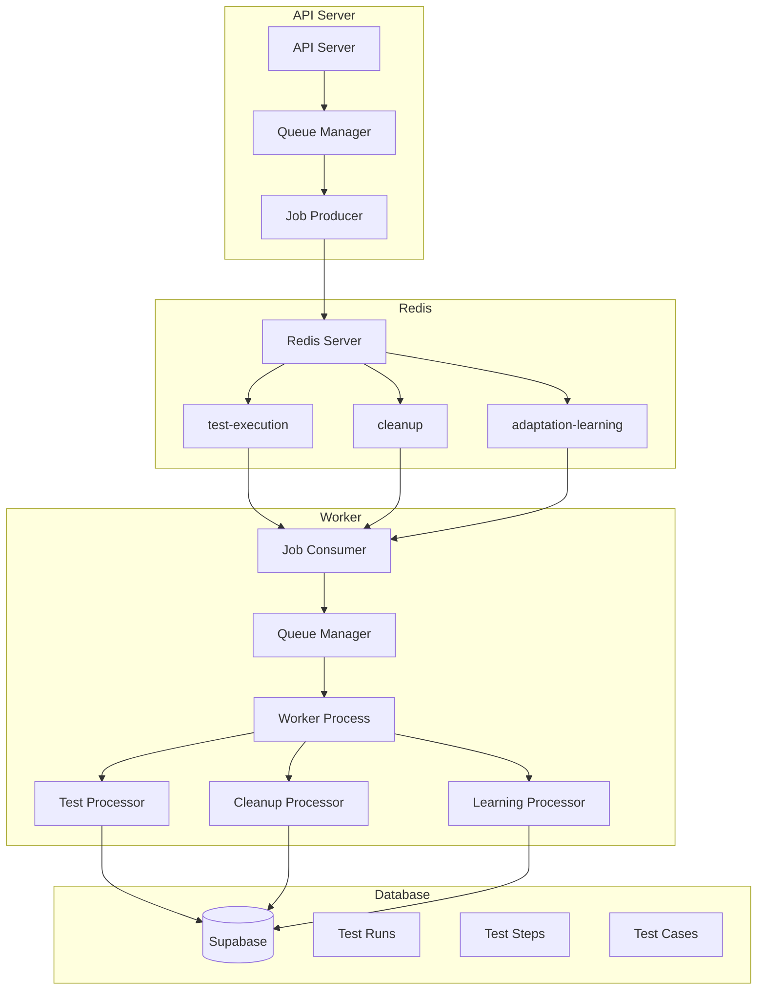

# Queue System Architecture

Cinnamon-QA의 큐 시스템 아키텍처에 대한 상세 설명입니다.

## 🏗️ 전체 아키텍처

### 시스템 구성 요소



## 🔄 데이터 플로우

### 1. Job 생성 플로우

```
API Request → API Server → Queue Manager → Redis Queue → Worker → Database
```

1. **API Server**: 클라이언트로부터 테스트 실행 요청 수신
2. **Queue Manager**: 요청을 Job으로 변환하여 큐에 추가
3. **Redis Queue**: Job을 저장하고 Worker에게 전달 대기
4. **Worker**: Job을 수신하고 처리 시작
5. **Database**: 처리 결과를 데이터베이스에 저장

### 2. Job 처리 플로우

```
Worker Poll → Job Dequeue → Process → Update Progress → Complete → Result Store
```

1. **Worker Poll**: Worker가 큐에서 Job 폴링
2. **Job Dequeue**: Redis에서 Job 데이터 취득
3. **Process**: 실제 테스트 실행 (Playwright 등)
4. **Update Progress**: 진행률을 Redis를 통해 실시간 업데이트
5. **Complete**: Job 완료 후 결과 반환
6. **Result Store**: 최종 결과를 데이터베이스에 저장

## 📊 큐 구조 상세

### Redis 데이터 구조

```
Redis Database 0
├── bull:test-execution:         # 테스트 실행 큐
│   ├── waiting                  # 대기 중인 Jobs
│   ├── active                   # 실행 중인 Jobs
│   ├── completed                # 완료된 Jobs
│   ├── failed                   # 실패한 Jobs
│   └── events                   # 큐 이벤트
├── bull:cleanup:                # 정리 작업 큐
│   └── ... (동일 구조)
├── bull:adaptation-learning:    # 학습 작업 큐
│   └── ... (동일 구조)
└── progress:                    # 진행률 데이터
    ├── test-run-123
    └── test-run-456
```

### Job 상태 전이

```
┌─────────┐    ┌─────────┐    ┌────────┐    ┌───────────┐
│ waiting │───►│ active  │───►│ completed │
└─────────┘    └─────────┘    └────────┘
                     │
                     ▼
                ┌─────────┐    ┌─────────┐
                │ failed  │───►│ waiting │ (retry)
                └─────────┘    └─────────┘
```

## 🔧 구성 요소 상세

### 1. RedisClient (`redis.ts`)

**역할**: Redis 연결 관리 및 기본 작업 제공

```typescript
class RedisClient {
  - client: Redis
  - config: RedisConfig
  
  + connect(): Promise<void>
  + disconnect(): Promise<void>
  + healthCheck(): Promise<boolean>
  + instance: Redis (getter)
}
```

**주요 기능**:
- 연결 풀 관리
- 자동 재연결
- 헬스체크
- 설정 관리

### 2. QueueManager (`queue.ts`)

**역할**: BullMQ 큐 관리 및 Job 라이프사이클 제어

```typescript
class QueueManager {
  - queues: Map<string, Queue>
  - workers: Map<string, Worker>
  - queueEvents: Map<string, QueueEvents>
  
  + getQueue(name): Queue
  + addTestJob(data, options): Promise<Job>
  + createWorker(name, processor, options): Worker
  + getQueueStats(name): Promise<Stats>
}
```

**주요 기능**:
- 큐 생성 및 관리
- Job 추가 및 우선순위 설정
- Worker 생성 및 설정
- 이벤트 모니터링

### 3. Job Processors (`jobs.ts`)

**역할**: 실제 작업 처리 로직 구현

```typescript
abstract class BaseJobProcessor {
  + abstract process(job): Promise<TestJobResult>
  # updateProgress(job, progress): Promise<void>
  # handleError(error, context): TestJobResult
}

class TestExecutionProcessor extends BaseJobProcessor {
  + process(job): Promise<TestJobResult>
}
```

**주요 기능**:
- 추상화된 Job 처리 인터페이스
- 진행률 업데이트
- 에러 처리
- 다양한 Job 타입 지원

## ⚙️ 설정 시스템

### 환경 변수 구성

```env
# Redis 연결 설정
REDIS_HOST=localhost        # Redis 서버 호스트
REDIS_PORT=6379            # Redis 서버 포트
REDIS_PASSWORD=            # Redis 비밀번호 (선택)
REDIS_DB=0                 # 사용할 DB 번호 (0-15)

# 큐 설정
QUEUE_CONCURRENCY=2        # Worker 동시성
QUEUE_MAX_ATTEMPTS=3       # 최대 재시도 횟수
QUEUE_REMOVE_ON_COMPLETE=100  # 완료된 Job 보관 수
QUEUE_REMOVE_ON_FAIL=50    # 실패한 Job 보관 수
```

### 동적 설정

```typescript
const config: QueueConfig = {
  redis: {
    host: process.env.REDIS_HOST,
    port: parseInt(process.env.REDIS_PORT),
    // ... 기타 설정
  },
  defaultJobOptions: {
    removeOnComplete: 100,
    removeOnFail: 50,
    attempts: 3,
    backoff: {
      type: 'exponential',
      delay: 2000,
    },
  },
};
```

## 🔒 보안 및 안정성

### 1. 연결 보안

- **TLS 지원**: Redis 연결시 TLS 암호화
- **인증**: Redis AUTH를 통한 접근 제어
- **네트워크 격리**: 내부 네트워크에서만 접근 가능

### 2. Job 안정성

- **재시도 메커니즘**: 실패한 Job 자동 재시도
- **타임아웃 처리**: 긴 시간 실행되는 Job 타임아웃
- **데드레터 큐**: 반복 실패 Job 별도 처리

### 3. 모니터링

- **헬스체크**: 주기적인 시스템 상태 확인
- **메트릭 수집**: Job 처리 통계 및 성능 지표
- **알림 시스템**: 장애 발생시 자동 알림

## 📈 성능 최적화

### 1. Redis 최적화

```redis
# Redis 설정 예시
maxmemory 2gb
maxmemory-policy allkeys-lru
save 900 1
save 300 10
save 60 10000
```

### 2. 큐 최적화

- **배치 처리**: 여러 Job을 한번에 처리
- **우선순위 큐**: 중요한 Job 우선 처리
- **동적 스케일링**: 큐 길이에 따른 Worker 자동 조정

### 3. Worker 최적화

- **동시성 조정**: 서버 리소스에 맞는 동시성 설정
- **메모리 관리**: Job 처리 후 메모리 정리
- **연결 풀링**: 데이터베이스 연결 재사용

## 🔍 디버깅 및 로깅

### 로그 레벨

```typescript
enum LogLevel {
  ERROR = 0,    // 오류만
  WARN = 1,     // 경고 이상
  INFO = 2,     // 정보 이상
  DEBUG = 3,    // 모든 로그
}
```

### 디버그 모드

```bash
# BullMQ 디버그 로그 활성화
DEBUG=bull* npm start

# Redis 명령어 로그 활성화
DEBUG=ioredis:* npm start

# 모든 디버그 로그 활성화
DEBUG=* npm start
```

### 로그 출력 예시

```
[2025-01-08 13:30:00] INFO: Redis connected to localhost:6379
[2025-01-08 13:30:01] INFO: Queue 'test-execution' created
[2025-01-08 13:30:02] INFO: Worker started with concurrency 2
[2025-01-08 13:30:03] DEBUG: Job test-123 added to queue
[2025-01-08 13:30:04] INFO: Job test-123 started processing
[2025-01-08 13:30:05] DEBUG: Job test-123 progress: 25%
[2025-01-08 13:30:10] INFO: Job test-123 completed successfully
```

## 🚀 확장성 고려사항

### 수평 확장

- **다중 Worker**: 여러 서버에서 Worker 실행
- **큐 분산**: 큐 타입별 전용 Redis 인스턴스
- **로드 밸런싱**: 큐 간 작업 부하 분산

### 수직 확장

- **메모리 증설**: Redis 메모리 용량 확장
- **CPU 최적화**: Worker 프로세스 수 조정
- **네트워크 대역폭**: Redis 연결 최적화

이 아키텍처는 Cinnamon-QA의 확장성과 안정성을 보장하면서도 유지보수가 용이하도록 설계되었습니다.